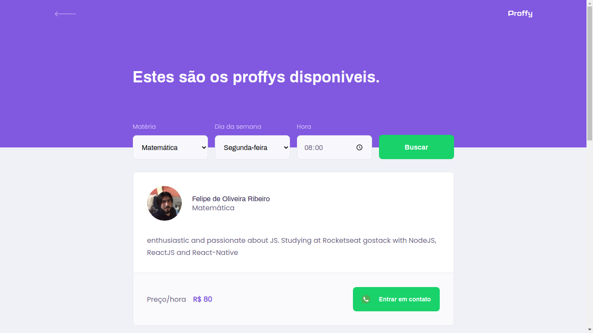
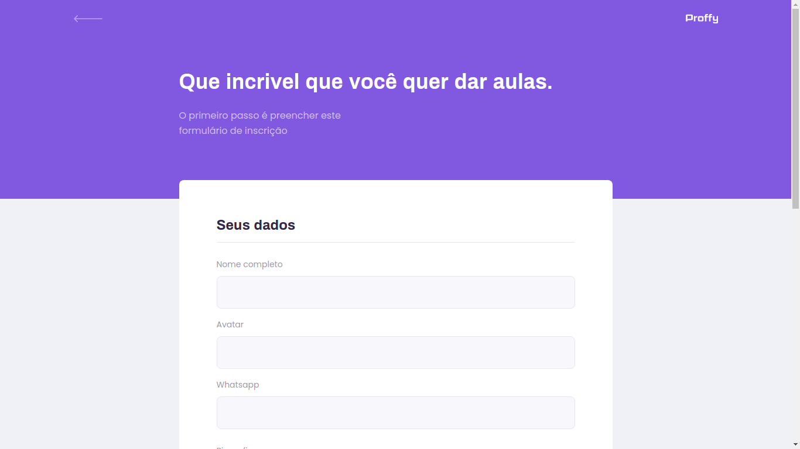
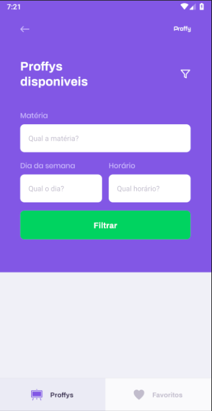

<!-- VARS -->

[proffy-logo]: .github/docs/images/proffy-logo.png
[reactjs-badge]: https://img.shields.io/badge/ReactJS-252525?logo=react&logoColor=252525&label=Proffy%20web&labelColor=00d8ff&style=for-the-badge
[nodejs-badge]: https://img.shields.io/badge/NODEJS-252525?logo=Node.js&logoColor=252525&label=Proffy%20server&labelColor=04D361&style=for-the-badge
[reactnative-badge]: https://img.shields.io/badge/MOBILE-252525?logo=react&logoColor=252525&label=Proffy&labelColor=5667f9&style=for-the-badge

<!-- VARS -->

<div align="center">

# 

### Plataforma de estudos online, onde é possivel conectar alunos com professores.

[![reactjs][reactjs-badge]](#desktop_computer-web)
[![nodejs][nodejs-badge]](#globe_with_meridians-server)
[![reactnative][reactnative-badge]](#iphone-mobile)


</div>

---

O Proffy é um projeto desenvolvido durante a **Next Level Week #2** da [@Rocketseat](https://github.com/Rocketseat) que ocorreu durante os dias _3 à 7 de Agosto de 2020_ e apresentada por [Diego Fernandes](https://github.com/diego3g).

---

# **Monorepo Getting Started**

Por se tratar de um monorepo a instalação de todos os modulos serão feitos simultaneamente, para isto basta acessar a pasta do projeto em qualquer nível e executar o comando:

```bash
yarn
```

> Depois do processo finalizar todas as Dependências estarão instaladas.

# **WEB - ReactJS**
[](https://www.figma.com/file/GHGS126t7WYjnPZdRKChJF/Proffy-Web?node-id=27%3A1703)

No desenvolvimento da versão web utilizamos a metodologia _mobile first_, que consiste em pensar primeiramente no layout para dispositivos mobile, e depois adapta-la para dispositivos desktops.

Desenvolvida utilizando:
  - [**React**](https://reactjs.org/)
  - [**Typescript**](https://www.typescriptlang.org/)

<div align="center">


 

</div>

## **Getting Started**

Entre na pasta [`packages/web/`](packages/web/) e execute o comando:

```bash
yarn start
```

> Por padrão o **servidor de desenvolvimento** ficará aberto no endereço: [`http://localhost:3000`](http://localhost:3000)

## **Build**

```bash
yarn build
```

---

# **Mobile - Expo React Native**

[](https://www.figma.com/file/uqCQxfIV006SDgCRVfsMmI/Proffy-Mobile-Copy)

Desenvolvida utilizando:
-[**React Native**](https://reactnative.dev/).
-[**Typescript**](https://www.typescriptlang.org/).
-[**Expo _SDK 38_**](https://expo.io/).

Home | Study | Favorites
---|---|---
|  |  |  |

## **Getting Started**

Entre na pasta [`packages/mobile/`](packages/mobile/) e execute o comando:

_Caso não possua o **expo-cli** em seu computador, execute o seguinte comando previamente_

```bash
yarn global add expo-cli
```
Depois de garantir que possui o **expo-cli** em seu computador, basta iniciar com o comando:

```bash
yarn start
```

> O Expo DevTools irá abrir no host: [`http://localhost:19002`](http://localhost:19002)

## **Build**

Para dar build em seu app confira a documentação do site official do [expo](https://docs.expo.io/distribution/building-standalone-apps/)

---

# **Server - NodeJS**

No desenvolvimento da versão do servidor utilizamos o conseito _Rest API_.

Desenvolvida utilizando: 
-[**NodeJS**](https://nodejs.org/).
-[**Typescript**](https://www.typescriptlang.org/).
-[**SQLite3**](https://sqlite.org/).
-[**Knex**](http://knexjs.org/).
-[**Express**](http://expressjs.com/).

## Features

|route|method|params|descricao|
|---|---|---|---|
|`/connections`|GET| - |lista o total de conexões|
|`/connections`|POST| `Body: { user_id: number }` |adiciona uma conexão na contagem passando o user_id|
|`/classes`|GET|`Query: week_day=number, subject=string, time=string`|lista as classes que estiverem nos filtros passados por query params. **week_day** é o dia da semana. **subject** a máteria da aula. **time** é o horário de inicio, ex: 8:00|
|`/classes`|POST|Olhe o exemplo a baixo|salva uma nova classe|

> exemplo de post da classe
```typescript
interface ISchedule {
  week_day: number
  from: string
  to: string
}

interface IClasseBody {
	name: string // teachet name
	avatar: string // teacher link to avatar image
	whatsapp: string // teacher whatsapp number. ex: +5511999888777
	bio: string // teacher bio
	subject: string
	cost: number // cost to class
	schedule: ISchedule[]
}

// ex request post with axios
api.post('/classes', {
	name: "Felipe O. Ribeiro",
	avatar: "https://avatars2.githubusercontent.com/u/20546600?s=400&u=eac1ba32c63275e2afd1cb5fbbcab902e2d97e24&v=4",
	whatsapp: "+5511999888777",
	bio: "Não sabe matemática",
	subject: "Matemática",
	cost: 10,
	schedule: [
		{ week_day: 1, from: "8:00", to: "12:00" },
		{ week_day: 3, from: "10:00", to: "18:00" },
		{ week_day: 4, from: "8:00", to: "12:00" }
	]
})

```

## **Getting Started**

Entre na pasta [`packages/server/`](packages/server/) e execute o comando:

```bash
# cria as tabelas no banco de dados
yarn knex:migrate

# inicia o servidor
yarn start
```

> Por padrão o **servidor de desenvolvimento** ficará aberto no endereço: [`http://localhost:3333`](http://localhost:3333)
